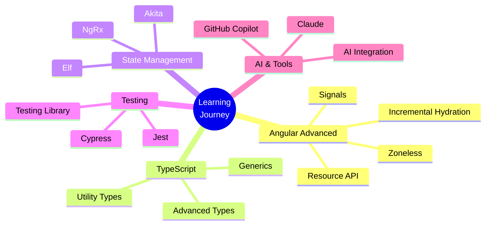

<div align="center">
  
# Hi, I'm Mohamed Askar! 👋
### Passionate Frontend Developer | Angular Enthusiast | Code Creator


</div>

---

## 💫 About Me

```typescript
const askar = {
  name: "Mohamed Askar",
  passion: "Building beautiful, functional web applications",
  currentFocus: "Modern Angular (16-20) & TypeScript",
  learning: ["Angular Signals", "RxJS Advanced Patterns", "AI Integration"],
  interests: ["Cricket 🏏", "Badminton 🏸", "Films 🎬", "Tech News 📱"],
  philosophy: "Code with passion, learn with curiosity, build with purpose",
  dailyRoutine: ["Code", "Play Badminton", "Learn Something New", "Repeat"],
  funFact: "I write Angular content daily and dream in TypeScript! 💭"
};
```

<div align="center">

### 🔥 What Drives Me

*"I don't just write code, I craft experiences. Every component, every line of TypeScript is an opportunity to create something amazing."*

</div>

---

## 🚀 My Coding Journey

- 💻 **Passionate about Frontend Development** - Creating intuitive, responsive user interfaces
- 🎯 **Angular Specialist** - Deep diving into modern Angular features and best practices
- 📚 **Continuous Learner** - Always exploring new technologies and patterns
- ✍️ **Content Creator** - Sharing Angular tips and insights on X/Twitter daily
- 🎨 **UI/UX Enthusiast** - Believing great code meets great design
- 🌱 **Open Source Aspirant** - Planning to contribute more to the community
- 💡 **Entrepreneurial Mindset** - Exploring ideas and building side projects

---

## 🛠️ Tech Stack & Tools

<div align="center">

### 💻 Frontend Technologies

<table>
<tr>
<td align="center" width="96">

<br>Angular
</td>
<td align="center" width="96">

<br>TypeScript
</td>
<td align="center" width="96">

<br>JavaScript
</td>
<td align="center" width="96">

<br>HTML5
</td>
<td align="center" width="96">

<br>CSS3
</td>
<td align="center" width="96">

<br>SASS
</td>
</tr>
</table>

### 🧰 Development Tools

<table>
<tr>
<td align="center" width="96">

<br>VS Code
</td>
<td align="center" width="96">

<br>Git
</td>
<td align="center" width="96">

<br>GitHub
</td>
<td align="center" width="96">

<br>npm
</td>
<td align="center" width="96">

<br>Jest
</td>
<td align="center" width="96">

<br>Webpack
</td>
</tr>
</table>

### 🎨 Design & Prototyping

<table>
<tr>
<td align="center" width="96">

<br>Figma
</td>
<td align="center" width="96">

<br>Tailwind
</td>
<td align="center" width="96">

<br>Bootstrap
</td>
</tr>
</table>

### 🔧 Backend & Database (Learning)

<table>
<tr>
<td align="center" width="96">

<br>Node.js
</td>
<td align="center" width="96">

<br>Express
</td>
<td align="center" width="96">

<br>MongoDB
</td>
<td align="center" width="96">

<br>Firebase
</td>
</tr>
</table>

</div>

---

## 🎯 What I'm Working On

<div align="center">

| 🚀 Project | 📝 Description | 🛠️ Tech Stack |
|-----------|---------------|---------------|
| **Daily Angular Content** | Sharing modern Angular tips & tricks on X | Angular 18-20, TypeScript |
| **Personal Portfolio** | Building my developer portfolio website | Angular, SCSS, Animations |
| **Component Library** | Creating reusable Angular components | Angular Standalone, Signals |
| **Learning Projects** | Experimenting with new Angular features | RxJS, Zoneless, Resource API |
| **Side Ideas** | Exploring startup concepts in hospitality tech | Full-stack, AI Integration |

</div>

---

## 📚 Currently Learning & Exploring

<div align="center">



</div>

---

## 📊 GitHub Stats

<div align="center">


[](https://github.com/askarthemasss)
[](https://twitter.com/askarthemass)

<br/>


<br/>


<br/>

### 🏆 GitHub Trophies


</div>

---

## 🎨 Coding Activity

<div align="center">

<!--START_SECTION:waka-->
<!--END_SECTION:waka-->


</div>

---

## 💡 Philosophy & Goals

<div align="center">

### 🎯 2026 Goals

✅ Build and launch 3 major personal projects  
✅ Contribute to 5+ open-source Angular projects  
✅ Share 365 Angular tips on X/Twitter (daily challenge)  
✅ Create and publish an Angular component library  
✅ Master advanced RxJS patterns and operators  
✅ Learn and implement AI features in web apps  
✅ Start a tech YouTube channel or blog  
✅ Collaborate with other developers on exciting projects  

### 💭 Coding Philosophy

*"Write code that speaks for itself. Make it clean, make it readable, make it maintainable. Every function, every component is a story - tell it well."*

</div>

---

## 🌱 Beyond Code

<div align="center">

| 🏏 Cricket | 🏸 Badminton | 🎬 Films | 🚀 Tech | 💼 Entrepreneurship |
|-----------|-------------|---------|--------|---------------------|
| Dhoni Fan | Regular Player | Suriya Movies | AI Enthusiast | Startup Ideas |
| IPL Follower | Stay Fit | Tamil Cinema | Latest Tech News | Building Skills |

</div>

---

## 📫 Let's Connect!

<div align="center">

I love connecting with fellow developers, tech enthusiasts, and anyone passionate about building great things!  
Whether you want to discuss Angular, cricket, startup ideas, or just say hi - I'm always up for a chat! 🚀

<br/>

<a href="https://twitter.com/askarthemass">
  
</a>
<a href="https://www.linkedin.com/in/mohamed-askar-a-9370a1b2/">
  
</a>
<a href="mailto:mohamedaskar476@gmail.com">
  
</a>
<a href="https://github.com/askarthemasss">
  
</a>

<br/><br/>

### 💬 Open to

🤝 Collaborations on Angular projects  
💡 Discussing tech, cricket, and startup ideas  
🎯 Freelance frontend development opportunities  
📚 Knowledge sharing and learning together  
🌟 Building something awesome!  

</div>

---

<div align="center">

### 🎵 Fun Facts

🎮 I debug in my dreams  
☕ Coffee + Code = Perfect Day  
🌙 Night owl developer  
🎯 Perfectionist with code formatting  
🚀 Always shipping features  

<br/>


<br/><br/>

### ⚡ Keep Building, Keep Learning!


</div>
